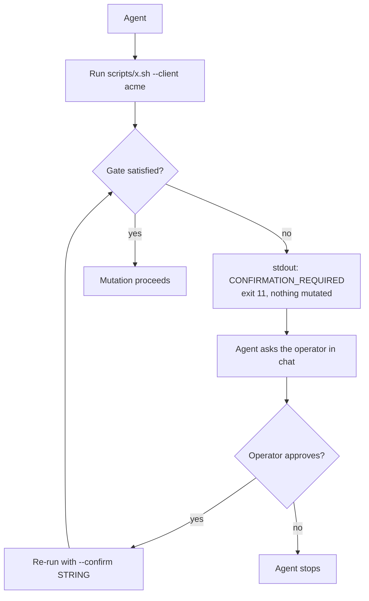

# Approval Convention

## Purpose

Every mutating operation requires explicit, typed confirmation. There is no `y/N`
prompt, no default-yes, no environment-variable bypass, and no `--force`.

The toolkit is designed to be driven by an agent, so approval is expressed as a
**flag**, not as terminal input.

---

## The Approval Model



The script performs **no mutation at all** until every gate it needs is satisfied.
Gate checks happen before the first write, and the check is repeated immediately
before each mutating step it guards.

### Passing a Gate

```bash
--confirm "<STRING>"
```

- The flag may be repeated; one flag per gate.
- Matching is exact and case-sensitive: `confirm deploy` is not `CONFIRM DEPLOY`.
- Each gate listed below requires its own flag. There is no wildcard.
- An invocation that needs several gates is satisfied in one call:

```bash
bash scripts/freeze.sh --client acme \
    --confirm "CONFIRM FREEZE" \
    --confirm "CONFIRM DISABLE CRON"
```

### Missing or Wrong

The script exits `11` and emits, with nothing mutated:

```json
{
  "skill": "deploy-site",
  "client": "acme",
  "status": "CONFIRMATION_REQUIRED",
  "timestamp": "2026-09-16T14:03:12Z",
  "duration_seconds": 1,
  "warnings": [],
  "errors": [],
  "gates": ["DEPLOY"],
  "confirm_strings": ["CONFIRM DEPLOY"],
  "confirm_string": "CONFIRM DEPLOY",
  "reason": "approval_required"
}
```

`reason` is `approval_required` when no flag was passed, `approval_mismatch` when a
flag was passed but matched nothing. `confirm_string` is present only when exactly one
gate is missing; `confirm_strings` always lists all of them.

---

## Gate Table

This table is authoritative. A gate string that is not here does not exist; a
mutating step that is not here must not exist.

| Gate | Confirmation string | Enforced by | Immediately before |
|------|--------------------|-------------|--------------------|
| Deploy a new release | `CONFIRM DEPLOY` | `deploy-site/scripts/deploy.sh` | Acquiring the deployment lock |
| Run migrations | `CONFIRM MIGRATIONS` | `deploy-site/scripts/deploy.sh` | The migration step |
| Activate a release | `CONFIRM ACTIVATE` | `deploy-site/scripts/deploy.sh` | The atomic symlink swap |
| Reload runtime | `CONFIRM RELOAD` | `deploy-site/scripts/deploy.sh` | `systemctl reload` |
| Restart workers | `CONFIRM RESTART WORKERS` | `deploy-site/scripts/deploy.sh` | Worker restart |
| Prune old releases | `CONFIRM PRUNE` | `deploy-site/scripts/deploy.sh` | Deleting old release directories |
| Roll back | `CONFIRM ROLLBACK` | `deploy-site/scripts/rollback.sh` | The symlink swap |
| Change nginx config | `CONFIRM NGINX CHANGE` | `ssl-dns-fix/scripts/fix-nginx.sh` | Writing the vhost |
| Issue or renew a certificate | `CONFIRM CERT ISSUE` | `ssl-dns-fix/scripts/fix-cert.sh` | The real `certbot` run |
| Change DNS records | `CONFIRM DNS CHANGE` | `migrate-site/scripts/cutover.sh` | Applying the record diff |
| Disable source cron | `CONFIRM DISABLE CRON` | `migrate-site/scripts/freeze.sh` | Disabling the source crontab |
| Prune snapshots | `CONFIRM PRUNE` | `backup-restore/scripts/setup-backup.sh` | Retention pruning |
| Install workers and cron | `CONFIRM SETUP` | `queue-cron-setup/scripts/setup-workers.sh` | Writing units and crontab |
| Restart workers gracefully | `CONFIRM RESTART` | `queue-cron-setup/scripts/restart-workers.sh` | `queue:restart` |
| Configure monitoring | `CONFIRM MONITORING SETUP` | `server-monitoring/scripts/setup-monitoring.sh` | Adding checks |
| Initialise backups | `CONFIRM BACKUP SETUP` | `backup-restore/scripts/setup-backup.sh` | Repo init and cron install |
| Restore to scratch | `CONFIRM RESTORE` | `backup-restore/scripts/restore.sh` | Restoring |
| Restore over live data | `CONFIRM RESTORE <client>` | `backup-restore/scripts/restore.sh` | Overwriting live data |
| Prepare the migration target | `CONFIRM PREPARE` | `migrate-site/scripts/prepare-target.sh` | Mutating the target host |
| Run the bulk/delta sync | `CONFIRM SYNC` | `migrate-site/scripts/sync.sh` | Writing to the target |
| Freeze the source | `CONFIRM FREEZE` | `migrate-site/scripts/freeze.sh` | Maintenance mode and final sync |
| Cut over | `CONFIRM CUTOVER` | `migrate-site/scripts/cutover.sh` | Changing DNS |
| Decommission the source | `CONFIRM DECOMMISSION` | `migrate-site/scripts/decommission.sh` | Removing source resources |

Read-only actions take no gate: `deploy-site/scripts/inspect.sh`,
`deploy-site/scripts/verify.sh`, `site-down-triage/scripts/triage.sh`,
`ssl-dns-fix/scripts/diagnose-ssl.sh`, `backup-restore/scripts/drill-restore.sh`,
`queue-cron-setup/scripts/inspect-queues.sh`,
`server-monitoring/scripts/status-monitoring.sh`,
`migrate-site/scripts/inventory.sh`, `migrate-site/scripts/verify.sh`.

`backup-restore/scripts/drill-restore.sh` restores into a scratch directory and then
destroys it. It is treated as read-only because it never touches live data.

---

## Implementation

The gate logic lives in `conventions/lib/confirm.sh` and is loaded by
`conventions/lib/bootstrap.sh`. Scripts wire it up in the argument parser:

```bash
while [[ $# -gt 0 ]]; do
    case "$1" in
        --client)  CLIENT="${2:-}"; shift 2 ;;
        --confirm) confirm_add "${2:-}"; shift 2 ;;
        --dry-run) DRY_RUN=true; shift ;;
        *) printf 'ERROR: Unknown argument: %s\n' "$1" >&2; exit 2 ;;
    esac
done
```

then, before the first mutation:

```bash
require_confirms \
    "CONFIRM DEPLOY"     "DEPLOY" \
    "CONFIRM MIGRATIONS" "MIGRATIONS" \
    "CONFIRM ACTIVATE"   "ACTIVATE"
```

`require_confirms` checks all gates at once, so an operator (or an agent relaying to
an operator) is asked once rather than discovering gates one at a time.

---

## No-Bypass Rules

| Rule | Enforcement |
|------|-------------|
| No environment-variable bypass | `CONFIRM_DEPLOY=1` has no effect; only the flag is read |
| No `--yes` / `--force` | Rejected as an unknown argument, exit 2 |
| No default timeout approval | There is no prompt to time out |
| No empty-string acceptance | `--confirm ""` never matches a gate string |
| Case-sensitive match | `confirm deploy` is not `CONFIRM DEPLOY` |
| No partial matching | `CONFIRM` does not satisfy `CONFIRM DEPLOY` |
| Per-gate flags | Each gate needs its own `--confirm`, with the exact table string |

There is no emergency override. An operation that cannot be approved does not happen.

---

## Dry Runs

`--dry-run` is orthogonal to approval, and always wins:

- `--dry-run` alone: plan produced, no gate requested, status `PLANNED`, exit 0.
- `--dry-run` plus `--confirm`: still a dry run. Approving a plan does not authorise
  the mutation; the operator must re-run without `--dry-run`.

---

## Audit Trail

Every gate evaluation is written to the run journal, whether it passed or not:

```markdown
## [2026-09-16T14:03:45Z] CONFIRMING: DEPLOY approved

**Command:** confirmation flags

**Exit Code:** 0
**Duration:** 0s

**State Transition:** CONFIRMING -> EXECUTING
```

```markdown
## [2026-09-16T14:03:45Z] CONFIRMING: Gates not approved (approval_required): DEPLOY, ACTIVATE

**Command:** confirmation flags

**Exit Code:** 11
**Duration:** 0s

**State Transition:** CONFIRMING -> STOPPED
```

---

## Summary

| Principle | Implementation |
|-----------|----------------|
| Explicit typed confirmation | Exact, case-sensitive string match on `--confirm` |
| No defaults, no shortcuts | No prompt, no env var, no `--force` |
| Per-gate independence | One `--confirm` flag per gate |
| Checked up front | All required gates are validated before the first mutation |
| Full audit trail | Every gate evaluation is journaled |
| No emergency bypass | Intentional; unapproved operations do not run |
